  

# 👋 Bem-vindo ao meu perfil

💻 Me chamo **Eduardo Henrique Barros Silva**, estudante de Engenharia de Software na Universidade Católica de Brasília 
🌐 Crio **sites web interativos** para pequenos comércios do DF 
🛡️ Me especializando em **cibersegurança**, com o objetivo de atuar como CISO 

## 📬 Contato

  
  

## 🚀 Stacks e ferramentas

  

## 🗂️ Projetos

* 💰 **[Chips](https://chipsgestao.com.br)**: SaaS de gestão financeira em TypeScript, com autenticação, integração de APIs e banco de dados em produção
* ✨ **Sites interativos**: landing pages com animações de scroll (GSAP) para comércios locais, do primeiro contato com o cliente até a publicação

## 🛡️ Certificações

* Google Cybersecurity Professional Certificate
* Google AI Essentials

## 📊 GitHub Stats

  
  

## 🔥 Streak

  

## 📈 Gráfico de atividades

  

## 🧠 Sobre mim

* 🎯 Buscando estágio em TI, com foco em segurança da informação
* 🔐 Estudando redes, Linux, SIEM e resposta a incidentes
* 🌐 Criando soluções web reais para clientes reais
* 📚 Sempre aprendendo algo novo
